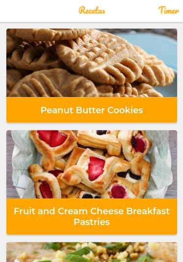

# App de Recetas

[Live Preview](https://recetasapp.now.sh/)

PWA que utiliza la API de MealDB para mostrar recetas con sus instrucciones. Algunas de las features que tiene son:

* Soporte Offline con Workbox
* Estrategias de Red apropiadas para cada recurso
* Add to Home Screen
* Web Share API

Creado con Create React App.
## Scripts
* npm install para instalar las dependencias
* npm run dev para entorno de desarrollo
* npm run build && npm start para producción

## Licencia

MIT

Este fue creado con [Create React App](https://github.com/facebook/create-react-app).